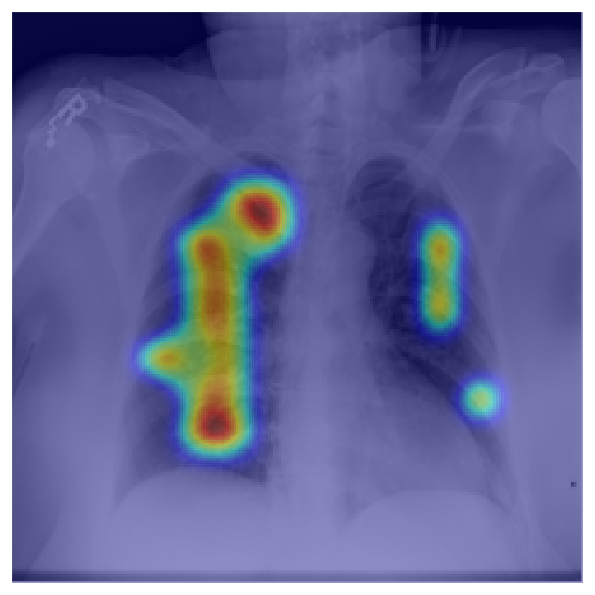
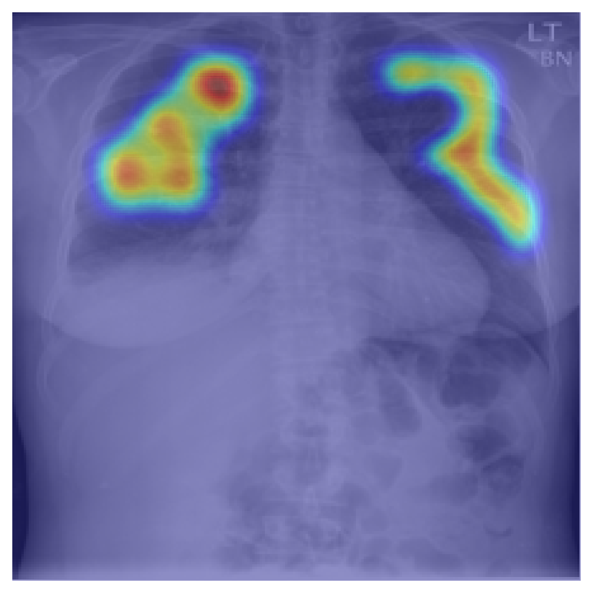

# Multimodal Clinical Vision-Language Learning for Chest X-ray Understanding

A lightweight multimodal deep learning framework for chest X-ray classification using both medical images and radiology report text. This project explores clinical vision-language fusion, weak-label learning, class imbalance handling, and cross-attention explainability.

---

## Overview

Chest X-ray interpretation often requires integrating visual findings with clinical language descriptions. This project develops a multimodal pipeline that combines:

* Chest X-ray images
* Radiology report findings
* Cross-modal attention fusion
* Multi-label disease prediction
* Attention-based explainability

The framework focuses on five thoracic abnormalities:

* Effusion
* Cardiomegaly
* Edema
* Pneumonia
* Pneumothorax

---

## Model Architecture

The model integrates:

* Vision Transformer (ViT-style image patch embeddings)
* Bio_ClinicalBERT text embeddings
* Cross-attention fusion between text tokens and image patches
* Lightweight MLP classification head

Pipeline:


```text
Chest X-ray Image                                 Radiology Findings Text
      ↓                                                     ↓
ViT Image Encoder                                ClinicalBERT Text Encoder
      ↓                                                     ↓
Image Patch Embeddings                            Text Token Embeddings
      └─────────────── Cross-Attention Fusion ──────────────┘
                              ↓
                        MLP Classifier
                              ↓
                  5 Abnormality Probabilities
```
---

## Dataset

This project uses the Indiana University Chest X-ray Collection:

[https://openi.nlm.nih.gov/faq](https://openi.nlm.nih.gov/faq)

Weak labels are automatically generated from radiology report impressions using rule-based extraction with negation handling.

---

## Example Cross-Attention Visualizations

### Pneumothorax Attention Map

Clinical token: `pneumothorax`

<p align="center">
  
</p>

---


### Pneumonia / Consolidation Attention

Clinical token: `consolidation`

<p align="center">
  
</p>

---


## Key Findings

* Multimodal fusion achieved meaningful disease ranking performance despite highly imbalanced labels.
* Unweighted training produced strong AUROC results but poor default-threshold recall.
* Label-specific threshold tuning substantially improved F1 performance.
* Cross-attention visualization provided interpretable inspection of clinical token ↔ image region interactions.

---

## Repository Structure

```
multimodal_cxt/
│
├── analysis/
├── data/
├── data_utils/
├── models/
├── outputs/
├── results/
├── scripts/
├── tests/
│
├── README.md
├── requirements.txt
└── .gitignore
```

---

## Installation

```bash
pip install -r requirements.txt
```
## Model Checkpoint

Trained model checkpoints are hosted separately due to GitHub file size limitations:

[https://drive.google.com/file/d/1U3FxaxTmX9XdB0by22N4mVykvwQiar5S/view?usp=sharing](https://drive.google.com/file/d/1k-4ZV9-CHbhc19QE6HYuQYGgsjQLS23U/view?usp=sharing)

## Example Commands

Build metadata:

```bash
python data_utils/build_iu_xray_metadata.py
```

Train model:

```bash
python scripts/train_unweighted.py
```

Evaluate:

```bash
python scripts/evaluate.py
```

Generate attention visualization:

```bash
python scripts/visualize_cross_attention.py
```

---

## Future Work

Potential future directions include:

* Grad-CAM and additional explainability methods
* Larger multimodal transformer architectures
* Better patch-level localization
* Vision-language pretraining
* External clinical validation

---

## Disclaimer

This repository is intended for research and educational purposes only. It is not a medical device and should not be used for clinical decision making.

---

## Author

Haoran Ding
Ph.D. in Computer Engineering, Purdue University

Research interests:

* Multimodal AI
* Clinical NLP
* Medical Imaging
* Vision-Language Learning
* Explainable AI
